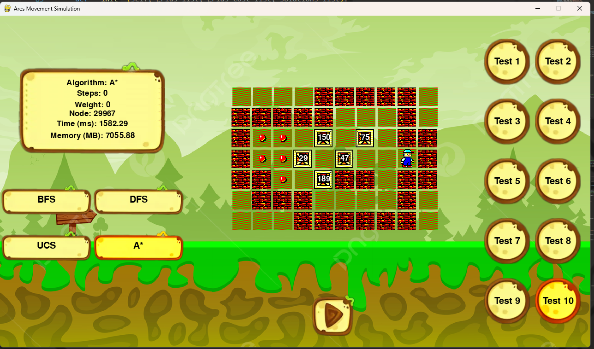

# Sokoban Solver with GUI  

This project leverages advanced search algorithms, including **BFS**, **DFS**, **UCS**, and **A***, to solve the puzzles in the classic Sokoban game. It features a Python-based **GUI**, meticulously designed to vividly showcase the step-by-step solutions generated by these algorithms.

## Features  
- Implements **BFS**, **DFS**, **UCS**, and **A*** algorithms to solve Sokoban puzzles.  
- Intuitive Python-based GUI to visualize solutions interactively.  
- Comprehensive test cases to ensure robust functionality.  

## Contributions  
- **@itnccuong** and **@john0148** contributed to the implementation of BFS, DFS, A*, and the development of test cases.  
- GUI design and implementation crafted to enhance user experience and clearly present solutions.

   
  <i>Demo</i>

